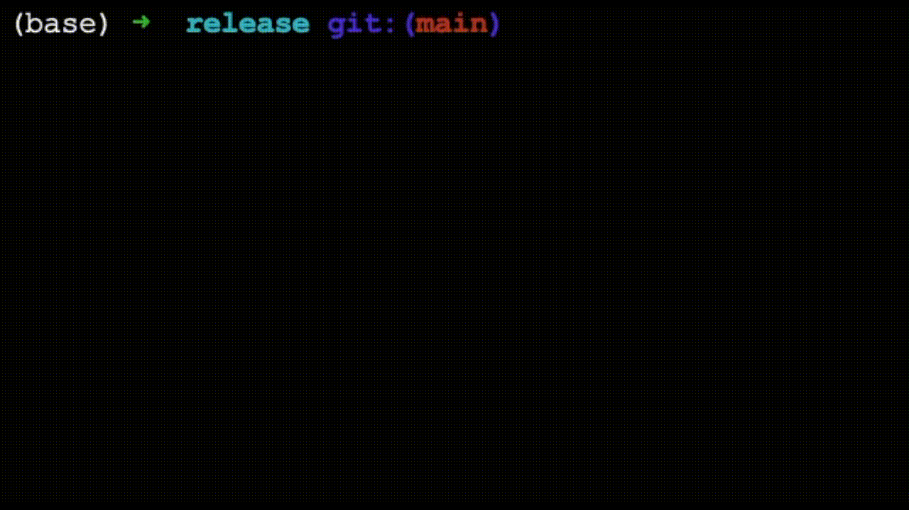

# wordle-player

A bot that can play [Wordle](https://www.powerlanguage.co.uk/wordle/), written completely in Rust. But the bot is more flexibile than the original game - you can give it a word of any length (and also change the number of turns you allow, depending on how hard you want to make it).

See below for a demo of it in action!

## Sources
Currently, the bot uses static text files as its dictionary & to know how frequent letters occur in the English language. Here are the sources of those files:
 1. word database comes from: https://github.com/dwyl/english-words/
 2. letter frequency comes from: https://www3.nd.edu/~busiforc/handouts/cryptography/letterfrequencies.html

## Stats

I'll keep track of the stats for how well it performs on the daily official Wordle puzzle below.

|    date    | word  |       solved       | turns |
| ---------- | ----- | ------------------ | ----- |
| 2022-01-17 | shire | :white_check_mark: |   4   |
| 2022-01-18 | proxy | :white_check_mark: |   5   |
| 2022-01-19 | point | :white_check_mark: |   3   |
| 2022-01-20 | robot | :white_check_mark: |   3   |
| 2022-01-21 | prick | :white_check_mark: |   6   |
| 2022-01-22 | wince | :white_check_mark: |   6   |
| 2022-01-23 | crimp | :white_check_mark: |   3   |
| 2022-01-24 | knoll | :white_check_mark: |   4   |
| 2022-01-25 | sugar | :white_check_mark: |   4   |
| 2022-01-26 | whack | :white_check_mark: |   5   |
| 2022-01-27 | mount | :white_check_mark: |   3   |
| 2022-01-28 | perky | :white_check_mark: |   5   |
| 2022-01-29 | could | :white_check_mark: |   3   |
| 2022-01-30 | wrung | :white_check_mark: |   4   |
| 2022-01-31 | light | :white_check_mark: |   4   |
| 2022-02-01 | those | :white_check_mark: |   3   |
| 2022-02-02 | moist | :white_check_mark: |   4   |
| 2022-02-03 | shard | :white_check_mark: |   4   |
| 2022-02-04 | pleat | :white_check_mark: |   5   |
| 2022-02-05 | aloft | :white_check_mark: |   4   |
| 2022-02-06 | skill |         :x:        |   -   |
| 2022-02-07 | elder | :white_check_mark: |   5   |
| 2022-02-08 | frame |         :x:        |   -   |
| 2022-02-09 | humor | :white_check_mark: |   4   |
| 2022-02-10 | pause | :white_check_mark: |   4   |
| 2022-02-11 | ulcer | :white_check_mark: |   3   |
| 2022-02-12 | ultra | :white_check_mark: |   4   |
| 2022-02-13 | robin | :white_check_mark: |   3   |
| 2022-02-14 | cynic | :white_check_mark: |   5   |
| 2022-02-15 | aroma | :white_check_mark: |   6   |
| 2022-02-16 | caulk | :white_check_mark: |   4   |
| 2022-02-17 | shake |         :x:        |   -   |
| 2022-02-18 | dodge | :white_check_mark: |   4   |
| 2022-02-19 | swill | :white_check_mark: |   6   |
| 2022-02-20 | tacit | :white_check_mark: |   6   |
| 2022-02-21 | other | :white_check_mark: |   3   |
| 2022-02-22 | thorn | :white_check_mark: |   3   |
| 2022-02-23 | trove |         :x:        |   -   |
| 2022-02-24 | bloke | :white_check_mark: |   5   |
| 2022-02-25 | vivid | :white_check_mark: |   5   |
| 2022-02-26 | spill | :white_check_mark: |   6   |
| 2022-02-27 | chant | :white_check_mark: |   4   |
| 2022-02-28 | choke | :white_check_mark: |   3   |
| 2022-03-01 | rupee | :white_check_mark: |   5   |
| 2022-03-02 | nasty | :white_check_mark: |   3   |
| 2022-03-03 | mourn | :white_check_mark: |   3   |
| 2022-03-04 | ahead | :white_check_mark: |   6   |
